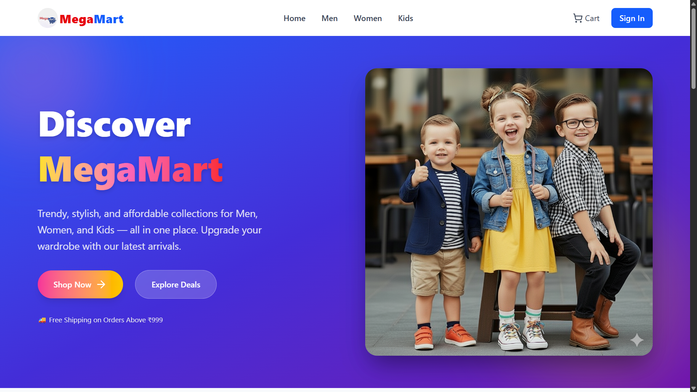
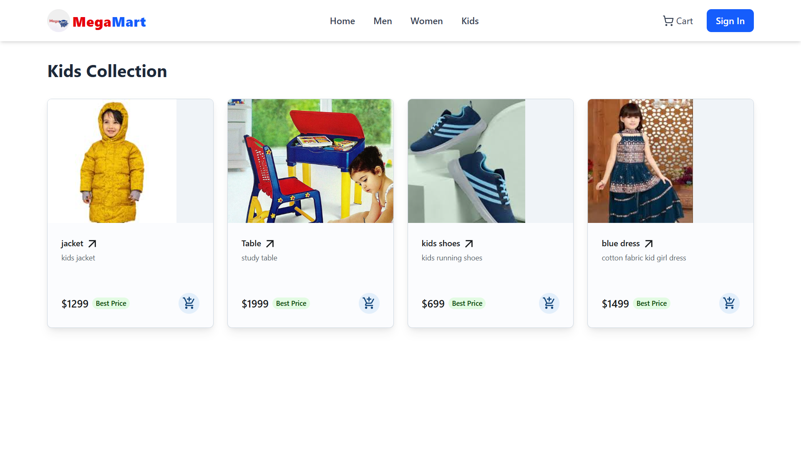
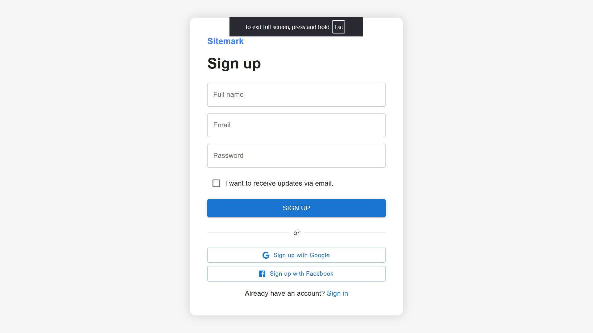
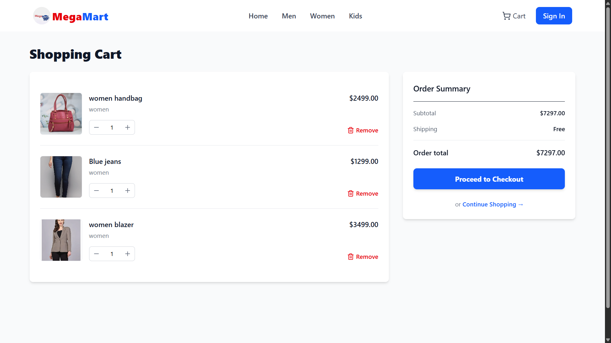
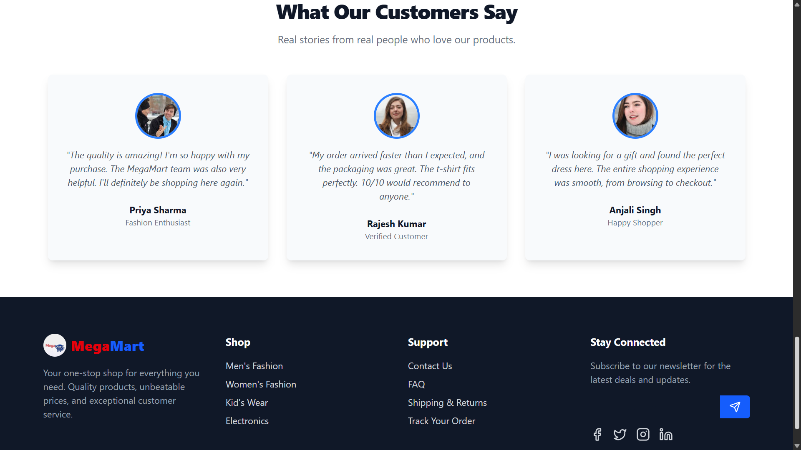

MegaMart: Full-Stack E-Commerce Platform
MegaMart is a comprehensive, full-stack e-commerce platform built on the MERN stack (MongoDB, Express.js, React, Node.js). It features a responsive, mobile-first user interface crafted with React and Tailwind CSS, offering intuitive navigation through dynamic product catalogs for men, women, and kids. The backend is powered by a robust Node.js and Express.js server that exposes a RESTful API to manage products, user data, and real-time shopping cart logic. Security is a key focus, with a complete end-to-end user authentication system implemented using JSON Web Tokens (JWT) for session management and bcryptjs for secure password hashing. This project demonstrates a complete application workflow, from seamless user interaction on the frontend to complex data management and security on the backend.

✨ Features
Frontend & User Experience
Modern & Responsive UI: Built with React and styled with Tailwind CSS for a clean, intuitive, and mobile-first design that looks great on any device.

Fast Client-Side Routing: Seamless navigation between the Home page, category pages (Men, Women, Kids), and product details without full-page reloads, powered by React Router.

Dynamic Product Catalogs: Users can easily browse and filter products directly from the homepage or dedicated category pages.

Detailed Product Views: Each product has its own dedicated page displaying detailed information, images, and pricing.

Interactive Shopping Cart: A fully functional cart where users can add, remove, and update item quantities with the total price updating in real-time.

Backend & API
Robust RESTful API: A well-structured backend API built with Node.js and Express that serves all frontend data needs efficiently.

Secure User Authentication: Complete user authentication system allowing users to sign up and log in securely.

Token-Based Authorization: Uses JSON Web Tokens (JWT) to secure user-specific routes and actions, ensuring that only authenticated users can access their data.

Secure Password Storage: Employs bcryptjs to hash user passwords before storing them in the database, ensuring high security.

Efficient Image Uploads: Handles multipart/form-data for product image uploads and storage using Multer middleware.

Structured Data Modeling: Utilizes Mongoose schemas to enforce a consistent and predictable data structure for users and products in the MongoDB database.

📸 Screenshots
Here are some glimpses of MegaMart in action:

### 🏠 Home Page

### 👶 Kids Section

### 📝 Sign Up

### 🛒 Cart Page

### 📌 Footer

🛠️ Tech Stack
Frontend: React, Vite, React Router, Axios, Tailwind CSS, Lucide React

Backend: Node.js, Express.js

Database: MongoDB with Mongoose

Authentication: JSON Web Token (JWT), bcryptjs

🚀 Getting Started
Follow these instructions to set up the project locally on your machine.

Prerequisites
Node.js (v18 or later)

MongoDB (local installation) or a MongoDB Atlas account.

Installation & Setup
Clone the repository:

Bash

git clone https://github.com/your-username/megamart.git
cd megamart
Setup the Backend:

Bash

# Navigate to the backend folder
cd backend

# Install dependencies
npm install

# Create a .env file and add your environment variables
# (see the .env.example section below)
touch .env

# Start the backend server
npm run dev
Setup the Frontend:

Bash

# Navigate to the frontend folder from the root directory
cd frontend

# Install dependencies
npm install

# Create a .env file and add your environment variables
touch .env

# Start the frontend development server
npm run dev
Environment Variables
You need to create a .env file in both the backend and frontend directories.

backend/.env

Code snippet

# Your MongoDB connection string (local or from Atlas)
MONGO_URI=mongodb://127.0.0.1:27017/MegaMart

# A long, random string for signing JWTs
JWT_SECRET=your_super_secret_jwt_key
frontend/.env

Code snippet

# The URL where your backend server is running
VITE_API_URL=http://localhost:5000/api
📝 API Endpoints
The backend provides the following RESTful API endpoints:

Auth Routes (/api/auth)
POST /signup: Register a new user.

POST /login: Log in an existing user and get a JWT.

POST /logout: Confirms user logout (client-side token removal).

Product Routes (/api/products)
GET /: Get all products.

GET /:id: Get a single product by its ID.

POST /: Create a new product (requires image upload).

PUT /:id: Update an existing product.

DELETE /:id: Delete a product.

Order Routes (/api/orders)
POST /: Creates a new order for the currently logged-in user. (Authenticated User)

GET /myorders: Fetches all orders belonging to the currently logged-in user. (Authenticated User)

GET /: Fetches a list of all orders from all users in the system. (Admin Only)

✒️ Author
Anurag Singh

LinkedIn: https://www.linkedin.com/in/anurag-singh-9598b4207/
